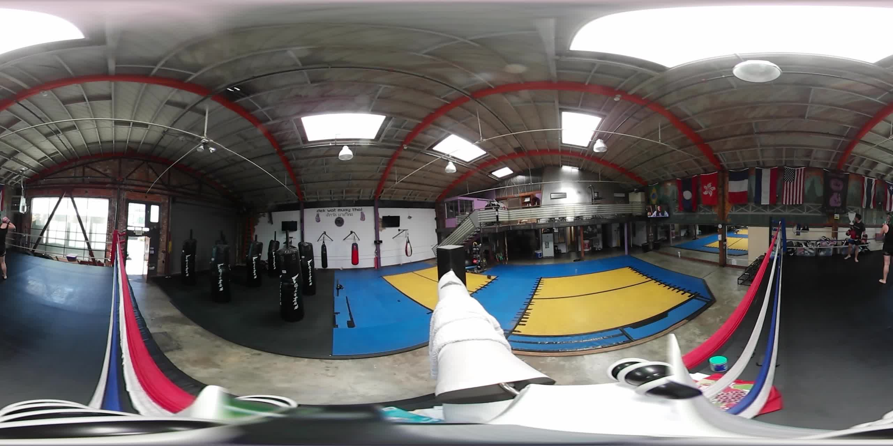

## Example

<p><span data-three-sixty-video><video poster="./images/muaythai.jpg" src="https://ada-pull-zone-egnalefgk5.netdna-ssl.com/mt2.webm" width="450" height="300" controls crossorigin="anonymous" type="video/webm; dimension=360;"></video></span>
<script src="build/main.js"></script></p>

* On a desktop you should be able to pan the video with the mouse.
* On a mobile you should be able to enter cardboard mode and view VR through a google cardboard.
* If in the Samsung browser for VR then entering full screen should display it using the native VR.

## Introduction

This project was researched in 20% time in the Financial Times lab, FTLabs.

The goal of the is project is to see whether it is possible to produce video using commercially available hardware and make it available cross platform without video, VR or web expertise.

Using the WebVR polyfill and THREE.js I assembled a simple 360 video viewer which to be embedded into a web page and will try to take advantage of native 360 video or WebVR support.

I have intention on adding this as an [origami](http://origami.ft.com/) module so that anyone can use this by just including a script/css with a small amount of markup.

## The markup

```html
<span data-three-sixty-video><video poster="./images/muaythai.jpg" src="https://ada-pull-zone-egnalefgk5.netdna-ssl.com/mt2.webm" width="450" height="300" controls crossorigin="anonymous" type="video/webm; dimension=360;"></video></span>
```

The outer span acts as a wrapper for the added DOM elements. The video's attributes:

* poster="[./images/muaythai.jpg](./images/muaythai.jpg)" - like with native video the poster (also a 360 image) will be displayed until the video is played.
* crossorigin="anonymous" - needed if the video is stored off site.
* type="video/webm; dimension=360;" - The `dimension=360;` part indicates to the Samsung VR web browser that this video should be displayed 360 when fullscreen.



## The hardware


